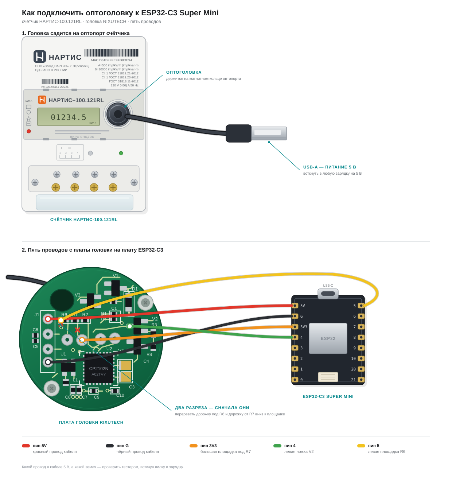
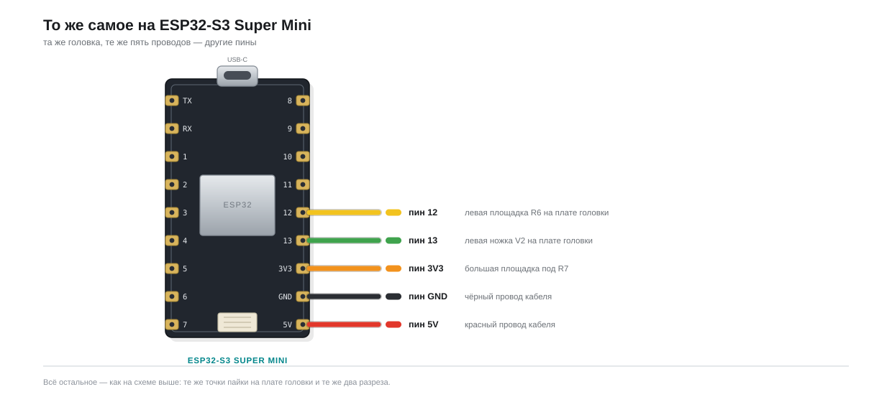

# Электриус-Опто

Прошивка для чтения электросчётчика **НАРТИС-100** через оптопорт на
**ESP32-S3** и **ESP32-C3** с отправкой показаний в облако Waterius.
Репозиторий и окружения сборки называются `esp32-opto`.



- чтение по СПОДЭС (DLMS/COSEM поверх HDLC) библиотекой GuruxDLMS.c;
- веб-морда: статус, настройки, Wi-Fi (портал перенесён из прошивки Waterius),
  лог в реальном времени;
- прозрачный serial по RFC 2217 в локальной сети;
- OTA: страница `/update`, ArduinoOTA, сервер Waterius — обновление не сбрасывает
  настройки.

Оптоголовка — доработанный кабель RIXUTECH на CP2102N, её разбор — в
[docs/](docs/README.md). Дизайн прошивки —
[docs/superpowers/specs/2026-09-17-esp32-opto-firmware-design.md](docs/superpowers/specs/2026-09-17-esp32-opto-firmware-design.md).

## Купить

| Что | Где |
|---|---|
| RIXUTECH Кабель-адаптер CP2102 для счетчиков | [aliexpress](https://aliexpress.ru/item/1005003440102435.html) |
| ESP32-C3 Super Mini | [aliexpress](https://aliexpress.ru/wholesale?SearchText=+ESP32-C3+super+mini) |

Головка идёт недоработанной: чтобы она заработала на C3, плату надо
переделать — [docs/02-rixutech-cp2102n-teardown.md](docs/02-rixutech-cp2102n-teardown.md).

**Про антенну.** У обычной C3 Super Mini антенна печатная, и её хватает, только
если счётчик стоит рядом с роутером. Если до роутера больше 3 метров, счётчик
в металлическом ящике или за бетонной стеной — брать версию с разъёмом и
внешней антенной.

## Сборка и прошивка

```sh
~/.platformio/penv/bin/pio run -e esp32-s3 -t upload     # прошивка
~/.platformio/penv/bin/pio run -e esp32-s3 -t uploadfs   # веб-страницы
```

Для ESP32-C3 — то же с `-e esp32-c3`.

### Один файл на чип

```sh
sh tools/build_release.sh        # → dist/electrius-opto-<версия>-esp32-{s3,c3}.bin
```

Скрипт склеивает загрузчик, таблицу разделов, otadata, приложение и образ
LittleFS в общий образ с адреса 0 — такой файл берут онлайн-заливщики и
`esptool.py write_flash 0x0 <файл>`. Заливать из браузера, без установки
чего-либо — [waterius.github.io/update](https://waterius.github.io/update/):
выбрать файл из `dist/`, адрес `0x0`, Chrome или Edge.

Образ S3 собирается под **8 МБ флеша** (плата `esp32-s3-devkitc-1`,
`default_8MB.csv`); у S3 Super Mini попадаются варианты на 4 и 16 МБ — под
них нужен свой раздел в `platformio.ini`. C3 — 4 МБ, `min_spiffs.csv`.

## Первое включение

1. Подключиться к сети Wi-Fi `esp32-opto-XXXX` — страница настройки откроется
   сама, иначе `http://192.168.4.1/wifi.html`.
2. Нажать «Найти сети» (сам по себе скан не запускается — он на две секунды
   уводит радио с канала и рвёт связь с телефоном), выбрать роутер, ввести
   пароль.
3. Телефон отключится от устройства: радио уходит на канал роутера и уводит за
   собой точку доступа. Снова выбрать сеть `esp32-opto-XXXX` и открыть
   `http://192.168.4.1/wifi.html` — выданный роутером адрес будет в строке «IP».
   Точка доступа ждёт три минуты после подключения, потом гаснет.
4. Если момент упущен: адрес есть в списке клиентов роутера и в USB-логе, а без
   них — сканером [tools/lan_scan.html](tools/lan_scan.html): скачать файл,
   открыть в браузере, указать свою подсеть и нажать «Сканировать». Плата
   отвечает по HTTP на порту 80.
5. На `/settings` задать ключ и e-mail облака Waterius. Как завести прибор
   в платформе и откуда взять ключ — [инструкция в
   вики](https://wiki.waterius.ru/pribor/storonnie-svoy-umnyy-dom).

Сброс к заводским настройкам — удержать кнопку BOOT 5 секунд.

## Веб-страницы без платы

Симулятор устройства поднимает те же страницы из `data/` и то же API, что и
прошивка, — правки в вёрстке и кнопки видно сразу:

```sh
python3 tools/fake_device.py          # http://127.0.0.1:8000/
python3 tools/fake_cloud.py           # заглушка облака, порт 8080
```

Протокол счётчика не эмулируется: показания, время, версию ПО, длительность
и результат чтения задаёт страница `/sim`. Отправка в облако настоящая — по
адресу из настроек.

## Подключение головки

Схема вверху — для ESP32-C3. На ESP32-S3 всё то же самое, отличаются
только номера пинов:



| Сигнал | ESP32-S3 | ESP32-C3 |
|---|---|---|
| RX (с головки) | GPIO13 | GPIO4 |
| TX (на головку) | GPIO12 | GPIO5 |

Питание головки и доработка платы — в [docs/02-rixutech-cp2102n-teardown.md](docs/02-rixutech-cp2102n-teardown.md).
