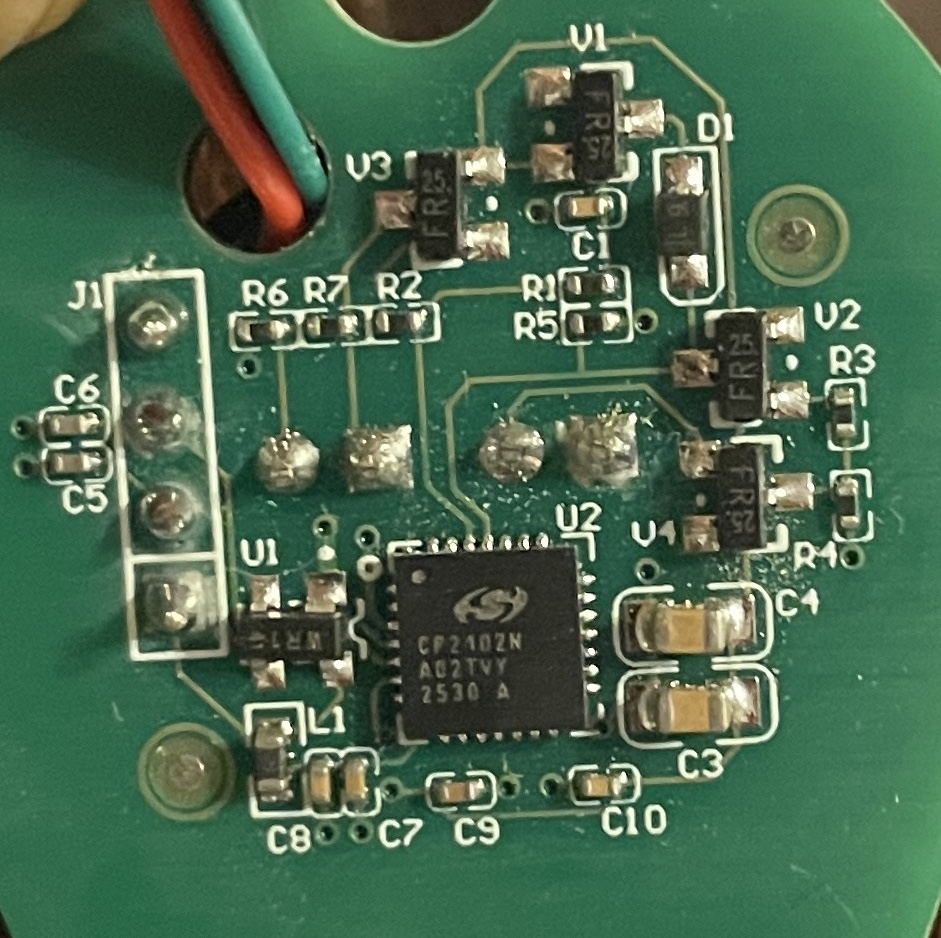
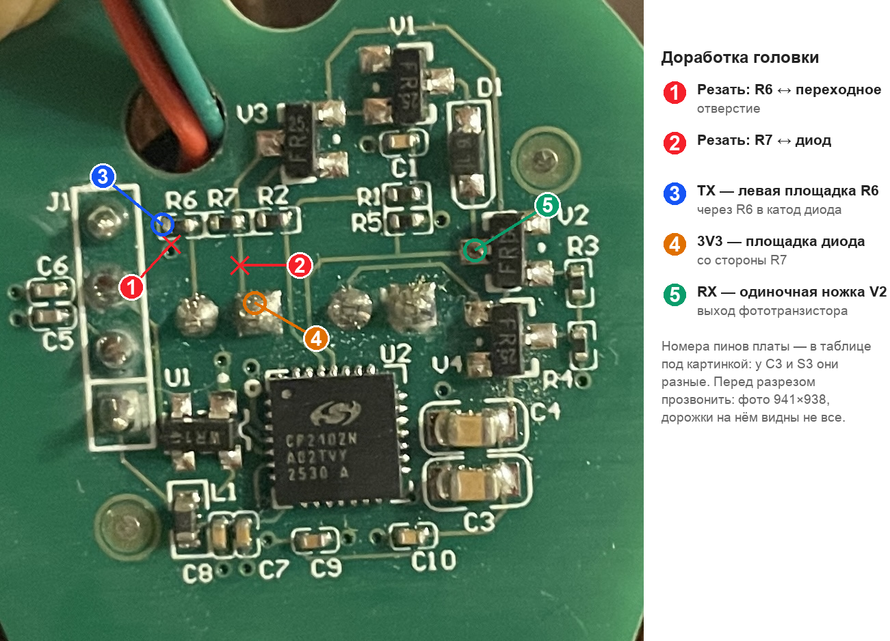

# 2. Разбор платы RIXUTECH и доработка



## Что на плате

| Позиция | Что это | Откуда |
|---|---|---|
| U2 | **CP2102N-A02, корпус QFN28** (маркировка `CP2102N A02TVY 2530 A`) | [по фото] |
| J1 | 4 площадки, сюда приходит USB-кабель (VBUS, D−, D+, GND) | [по фото] |
| 4 крупные сквозные площадки в центре | выводы ИК-светодиода и фототранзистора | [гипотеза]: сами компоненты с обратной стороны платы, лицом к счётчику |
| V1–V4 | транзисторы SOT-23 (маркировка не опознана) | [по фото] |
| R1–R7, D1 | обвязка ИК-части. **R2 = 2,2 кОм** [проверено: измерено мультиметром на плате, 2026-09-19]. Номиналы в ряду R6, R7, R2 **разные** — по одному судить об остальных нельзя | [по фото] |
| U1, L1, C5–C10 | питание / фильтрация USB | [гипотеза] |

CP2102N в корпусе QFN28 совместим по выводам с CP2101/2/9
**[проверено: даташит CP2102N]**.

## Выводы CP2102N QFN28

**[проверено: даташит CP2102N, табл. 5.1]**

| Ножка | Сигнал |
|---|---|
| 3 | GND |
| 4 / 5 | D+ / D− |
| 6 | VDD (3,0–3,6 В) |
| 7 | REGIN (вход регулятора 5 В) |
| 8 | VBUS |
| 9 | RSTb (активный низкий) |
| **25** | **RXD** (вход) |
| **26** | **TXD** (выход) |

Верхний ряд (ключ ножки 1 — точка в левом верхнем углу), слева направо:
DTR 28, DSR 27, **TXD 26**, **RXD 25**, RTS 24, CTS 23, GPIO.4 22.
TXD — третья ножка слева, RXD — четвёртая.

## Куда идут TXD и RXD

**[по фото]**, перед пайкой прозвонить. Про TXD — справка: в итоговой схеме
передатчик собран мимо моста и мимо R2, см. «Передатчик: ИК-диод напрямую на
GPIO».

- **ножка 26 (TXD) → правая площадка R2 (2,2 кОм)** — дальше на драйвер
  ИК-диода V3. То есть R2 — базовый резистор ключа: при 3,3 В это около
  1,5 мА в базу, жёсткое насыщение. В эталоне twam ту же роль играет R3 13 кОм
  (`docs/01`), там переключение мягче;

  **Не перепутайте с «R2 180 Ом» из [01](01-optical-probe-circuit.md)** — это
  позиционное обозначение с другой платы, там R2 ограничивает ток самого
  ИК-диода. Поставить 180 Ом в базу ключа нельзя;
- **ножка 25 (RXD) → одиночная (левая) ножка V2.** Одиночный вывод SOT-23
  у биполярного транзистора — коллектор **[гипотеза: цоколёвка по
  стандарту, маркировка не опознана]**, то есть это выход приёмника с
  подтяжкой, как Q4 + R16 в эталоне twam. R5, похоже, на этой же цепи
  (подтяжка) **[по фото]**.

## Почему подключаться именно к линиям CP2102N

На ножках 25/26 уже обычный UART: полярность и уровни такие, какие ждёт
UART-мост. Что делают V1–V4 (сколько каскадов, есть ли инверсия) — знать не
нужно.

Для приёмника так и вышло: провод с V2 работает, в схему приёмника мы не
лезли. Для передатчика довод не сработал — сигнал до диода не дошёл, и цепь
пришлось собрать заново (см. ниже).

## Доработка: разрезы и 5 проводов



1. **Питание.** Не отрезая вилку, воткнуть кабель в ПК и найти пару
   проводов с 5 В **[измерить]** (гипотеза: красный и чёрный). Отрезать
   вилку: 5 В → **5V** платы ESP32, земля → **GND**. Провода данных
   заизолировать. Регулятор CP2102N продолжит питать чип и приёмник.
2. **RX.** Провод с одиночной ножки V2 → `OPTO_RX_PIN` (у C3 пин 4, у S3
   пин 17). RXD у CP2102N — вход, конфликта нет, резать не нужно.
3. **TX.** Драйвер головки не используется: ИК-диод вешается прямо на GPIO —
   два провода и два разреза, следующий раздел. Разрез «ножка 26 ↔ R2» при
   этом не нужен: диод отвязан от ключа V3, бороться за линию уже нечему.
   Если он уже сделан — пусть остаётся, вреда нет.

## Передатчик: ИК-диод напрямую на GPIO

**[проверено: 2026-09-20, счётчик НАРТИС-100.121RL ответил, прошивка прочитала
показания]**

Штатный путь «провод TX → правая площадка R2 → ключ V3 → ИК-диод» у нас так и
не заработал: диод не светился ни разу — ни на камеру телефона, ни на счётчик.
Причину не установили; кандидаты — оторванная площадка R2, убитый ключ, севший
диод. Разбираться не стали, потому что драйвер головки в этой схеме не нужен
вовсе.

Транзистор в эталонной схеме ([01](01-optical-probe-circuit.md)) делает две
вещи, и обе ESP32 умеет сама. Инвертировать не надо: по IEC 62056-21 покой
линии — это единица и темнота, а GPIO в единице как раз ничего не светит.
Отдать ток — тоже не проблема: 10–13 мА ножка тянет с запасом (предел ESP32-C3
— 28 мА **[проверено: даташит ESP32-C3]**).

### Схема

```
3V3 платы ESP32 ──── 180 Ом ──── анод ИК-диод катод ──── GPIO (OPTO_TX_PIN)
```

Резистор — **тот самый, что стоит на плате головки рядом с диодом**, менять его
не надо. Надо перерезать дорожку, которой он сидел на +5 В головки, и питать его
с платы ESP32.

По шагам:

1. **Развернуть диод.** На заводской плате он стоит наоборот, под свой ключ.
   Отпаять, перевернуть, припаять обратно: **анод — к резистору 180 Ом, катод —
   на провод к GPIO**.
2. **Перерезать две дорожки**: от резистора 180 Ом к +5 В головки и от второго
   вывода диода к ключу V3. **[измерить]** прозвонкой: после разрезов пара
   «диод + резистор» не связана с остальной платой ничем.
3. **Провод с катода диода → `OPTO_TX_PIN`** (у C3 пин 5, у S3 пин 18).
4. **Провод со свободного конца резистора → 3V3 платы ESP32.**

Итого проводов между головкой и платой пять: 5V, GND, 3V3, TX, RX.

### Почему 3V3, а не +5 В головки

Питать диод от тех же 5 В, что и головку, нельзя, хотя соблазн есть — провод
уже там. GPIO выдаёт 3,3 В, и в единице на диоде останется 1,7 В: он **не
гаснет никогда**, а тихо светит миллиампера на два. Линия для счётчика всё
время в нуле, связи не будет. Вдобавок через диод на ножку попадает потенциал
выше VDD платы — прямой путь убить вход.

С 3V3 в единице на диоде ровно 0 В, он честно погашен.

### Как отличить анод от катода

Маркировке на прозрачном корпусе верить нельзя: у ИК-диодов метки разнятся, а
внутренности через мутный компаунд не разглядеть. Мультиметр в режиме «диод»
тоже врёт — напряжения тестера часто не хватает, и он показывает обрыв в обе
стороны, хотя диод жив (у нас так и вышло, зря списали диод в брак).

Надёжный способ — собрать ту самую цепь и померить ток:

| Ток при 3,3 В и 180 Ом | Что это значит |
|---|---|
| 0 мА | диод включён наоборот либо в обрыве |
| **10…13 мА** | **включён верно и жив** |
| ~18 мА (= 3,3 / 180) | диод закорочен |

У нас вышло **13,2 мА [проверено: измерено 2026-09-20]** — прямое падение
около 0,9 В. Через ножку GPIO будет чуть меньше, 11–12 мА: выход в нуле держит
не ровно 0 В.

## Проверки перед подключением ESP32

- **[измерить]** прозвонка: ножка 25 ↔ одиночная ножка V2.
- **[измерить]** после разрезов передатчика: резистор 180 Ом ↔ +5 В — обрыв,
  второй вывод диода ↔ ключ V3 — обрыв.
- **[измерить]** ток через диод 10…13 мА при 3,3 В (см. таблицу выше).
- **[измерить]** при поданных 5 В напряжение на площадке V2 ≈ **3,3 В**.
  [гипотеза]: так и будет, потому что это вход CP2102N, а он питается от
  3,3 В своего регулятора. Если там 5 В — нужен делитель, напрямую на GPIO нельзя.
- Проверка TX без счётчика: открыть прозрачную сессию RFC 2217 и слать нули —
  на 9600 8N1 линия в нуле 9 бит из 10, диод горит почти постоянно и его видно
  камерой телефона. Короткий кадр опроса (10 байт, 10 мс) камера не поймает.
- Проверка RX без счётчика: посветить в головку ИК-пультом. Смотреть **на
  115200**, а не на 9600: несущую 38 кГц приёмник UART на 9600 отбраковывает
  по старт-биту почти целиком (у нас 109 байт против 15274 на 115200).

## Если оторвалась площадка R2

Относится к старой схеме, где провод TX шёл на R2. В нынешней (диод прямо на
GPIO) площадка R2 не нужна вовсе — раздел оставлен на случай, если кто-то
захочет сохранить головку рабочей как USB-устройство.

Случалось на практике: правая площадка R2 — это точка, куда паяется провод TX,
и держится она на честном слове. Три выхода, по убыванию предпочтительности.

1. **Паять на торец самого резистора,** если он цел и оторвалась только медь.
   Электрически ничего не меняется. Провод обязательно закрепить каплей клея
   рядом: без площадки механической прочности нет.
2. **Держать CP2102N в сбросе** (следующий раздел) вместо разреза: восстановить
   перемычкой дорожку ножка 26 ↔ R2, посадить RSTb на GND, а провод TX паять на
   оставшийся огрызок дорожки со стороны ножки 26 — туда паять удобнее, чем на
   площадку. R2 остаётся в схеме на своём месте. Минус: головка перестаёт
   работать как USB-устройство.
3. **Внешний резистор 2,2 кОм** между проводом TX и левой площадкой R2.

## Вариант без разреза: держать CP2102N в сбросе

RSTb (ножка 9) на GND. По даташиту: «By default and during reset, these pins
are set to open-drain with a weak pull-up enabled» и «All pins temporarily
float high during a device reset» **[проверено: даташит CP2102N, 4.3.1]**.
Слабую подтяжку ESP32 перебьёт.

Минус: паять к ножке QFN сложнее, чем перерезать дорожку. Внешняя подтяжка
RSTb на плате не найдена **[по фото]**.
