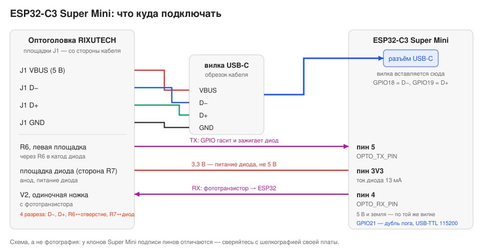
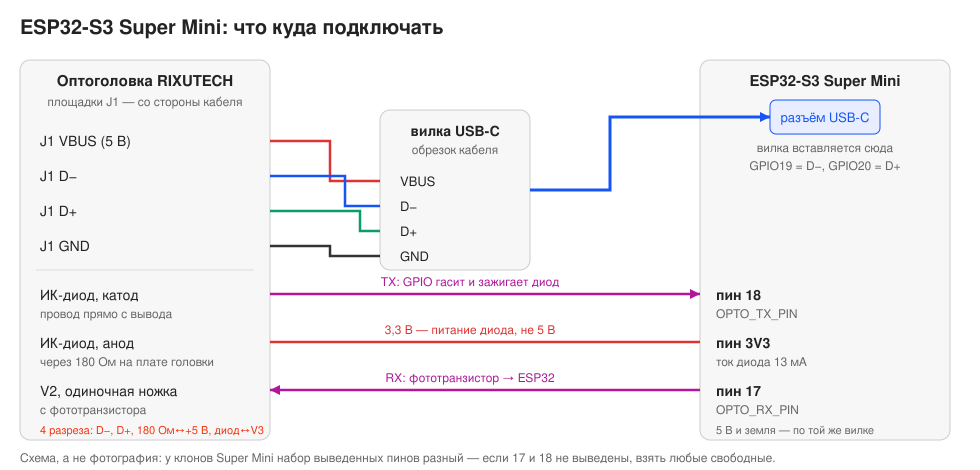

# 7. Прошивка платы через USB оптоголовки

Цель: вилка USB-A, которая торчит из головки RIXUTECH, должна определяться
компьютером как сама плата и прошивать её. Тогда один кабель делает всё:
воткнули в зарядку — устройство работает со счётчиком, воткнули в ноутбук —
прошивка, монитор и обмен по оптопорту одновременно.

## Идея

CP2102N отключается от шины USB совсем: линии данных кабеля уходят на USB-пины
ESP32, а мост остаётся на плате только источником 3,3 В для ИК-части.

```
было:   USB-A ── D+/D− ── CP2102N ── TXD/RXD ── ИК-часть
стало:  USB-A ── D+/D− ── ESP32 ── GPIO ── ИК-часть
                 └ VBUS ─ CP2102N (только питание 3,3 В для ИК-части)
```

Работает это потому, что контроллер USB Serial/JTAG у обоих чипов сидит в ПЗУ:
плата определяется как CDC-порт и прошивается без всякого моста
**[проверено: ESP-IDF, USB Serial/JTAG Console]**.

| Чип | D− | D+ |
|---|---|---|
| ESP32-C3 | GPIO18 | GPIO19 **[проверено: даташит ESP32-C3]** |
| ESP32-S3 | GPIO19 | GPIO20 **[проверено: даташит ESP32-S3]** |

## Разрезы в головке

Общие для обеих плат. Перед каждым — прозвонка: порядок площадок J1 по фото
не определён **[измерить]**.

| № | Что режем | Зачем |
|---|---|---|
| 1 | площадка J1 **D−** ↔ ножка 5 CP2102N | иначе на шине два устройства |
| 2 | площадка J1 **D+** ↔ ножка 4 CP2102N | то же |
| 3 | резистор 180 Ом ↔ **+5 В** головки | ИК-диод питается с 3V3 платы, иначе он не гаснет в единице ([02](02-rixutech-cp2102n-teardown.md#передатчик-ик-диод-напрямую-на-gpio)) |
| 4 | второй вывод ИК-диода ↔ ключ **V3** | диод уходит на GPIO, драйвер головки в схеме не участвует |

Разрез «ножка 26 (TXD) ↔ правая площадка R2» из старой редакции **больше не
нужен**: после 3 и 4 диод отвязан от моста, бороться за линию нечему.

**V2 ↔ ножка 25 (RXD) не режем**: RXD у моста — вход, выход приёмника спокойно
кормит два входа сразу.

Кабель остаётся припаянным к J1, новые провода идут на те же площадки со
стороны кабеля. Доработка обратима: перемычки поперёк разрезов возвращают
обычную головку.

## Чем соединять плату и кабель

У обеих плат Super Mini USB-пины на гребёнку **не выведены** — они идут прямо
в разъём USB-C, а чип стоит на плате без модуля (у S3 это ESP32-S3FH4R2
**[проверено: описание платы]**). Поэтому паять к ним негде, и самый простой
путь — не паять вовсе: четыре провода кабеля идут на **вилку USB-C** (обрезок
любого кабеля), вилка вставляется в разъём платы.

Распиновка вилки USB-C: **VBUS** — A4/A9/B4/B9, **D−** — A7/B7, **D+** —
A6/B6, **GND** — A1/A12/B1/B12. У обрезка кабеля проще прозвонить жилы, чем
искать документацию **[измерить]**. Линии CC не нужны: плата берёт питание
прямо с VBUS **[гипотеза: если плата не стартует — CC1 и CC2 через 5,1 кОм
на GND]**.

Побочная польза: разъём платы занят вилкой, и второй USB в него физически не
воткнуть — а это как раз то, чего делать нельзя.

Запасной вариант, если вилку ставить не хочется: припаяться к площадкам
разъёма USB-C на самой плате (шаг 0,25 мм, мелко) или, если у вашей платы всё
же стоит модуль ESP32-C3-MINI-1, к его краевым площадкам **26 = IO18** и
**27 = IO19** **[проверено: даташит модуля]**.

---

## ESP32-C3 Super Mini



| Точка на головке | Куда | Что это |
|---|---|---|
| площадка J1 **VBUS** | вилка USB-C, **VBUS** | питание платы и головки |
| площадка J1 **GND** | вилка USB-C, **GND** | общий |
| площадка J1 **D−** | вилка USB-C, **D−** | в плате это GPIO18 |
| площадка J1 **D+** | вилка USB-C, **D+** | в плате это GPIO19 |
| **катод ИК-диода** | пин **5** платы | `OPTO_TX_PIN` |
| **180 Ом → анод ИК-диода** | пин **3V3** платы | ток диода, 13,2 мА |
| одиночная ножка **V2** | пин **4** платы | `OPTO_RX_PIN`, с фототранзистора |

Отдельный провод на пин 5V не нужен — питание приходит по той же вилке.
Пару D+/D− вести коротко (до ~10 см) и скруткой: это полноскоростная шина
12 Мбит/с. Внешняя обвязка не нужна, Espressif рекомендует лишь
*зарезервировать* последовательные 22/33 Ом, не устанавливая их
**[проверено: ESP Hardware Design Guidelines, ESP32-C3]**.

---

## ESP32-S3 Super Mini



| Точка на головке | Куда | Что это |
|---|---|---|
| площадка J1 **VBUS** | вилка USB-C, **VBUS** | питание платы и головки |
| площадка J1 **GND** | вилка USB-C, **GND** | общий |
| площадка J1 **D−** | вилка USB-C, **D−** | в плате это GPIO19 |
| площадка J1 **D+** | вилка USB-C, **D+** | в плате это GPIO20 |
| **катод ИК-диода** | пин **18** платы | `OPTO_TX_PIN` |
| **180 Ом → анод ИК-диода** | пин **3V3** платы | ток диода, 13,2 мА |
| одиночная ножка **V2** | пин **17** платы | `OPTO_RX_PIN`, с фототранзистора |

Разница с C3 только в номерах пинов. Два предупреждения именно про S3:

- **Набор выведенных пинов у клонов разный**: где-то это IO1–IO18 и IO21,
  где-то только IO1–IO13 плюс TX/RX **[по распиновкам плат: сверяться с
  шелкографией]**. Если 17 и 18 не выведены, взять любые свободные и
  поменять `OPTO_RX_PIN` / `OPTO_TX_PIN` в `platformio.ini` — больше в коде
  менять нечего.
- Доработка **закрывает вариант «недоработанная головка через USB-хост»** из
  [05](05-alternatives.md): порт S3 становится устройством.

---

## Проверки

До пайки:

- **[измерить]** какая площадка J1 — D−, а какая D+: прозвонка на ножки 5 и 4
  CP2102N. Перепутанная пара = порт не определится;
- **[измерить]** где на кабеле 5 В: воткнуть в ПК и померить;
- **[измерить]** жилы вилки USB-C: VBUS, D−, D+, GND.

После:

- **[измерить]** обрыв по всем четырём разрезам;
- **[измерить]** ток через ИК-диод 10…13 мА при 3,3 В и 180 Ом — заодно это
  проверка полярности диода ([02](02-rixutech-cp2102n-teardown.md#как-отличить-анод-от-катода));
- **[измерить]** 5 В на VBUS и **3,3 В на одиночной ножке V2** — значит,
  регулятор CP2102N жив и ИК-часть питается **[гипотеза: регулятор работает
  независимо от того, энумерировался мост или нет; если 3,3 В нет — питать
  ИК-часть от пина 3V3 платы]**;
- воткнуть в Mac: появляется `/dev/cu.usbmodem*` (в Linux `/dev/ttyACM*`,
  в Windows — COM-порт);
- `~/.platformio/penv/bin/pio run -e esp32-c3 -t upload` и `-t uploadfs`
  обычной командой, порт определится сам;
- если порта нет: BOOT на GND (GPIO9 у C3, GPIO0 у S3), воткнуть кабель,
  отпустить — чип окажется в режиме загрузки **[проверено: ESP-IDF, Establish
  Serial Connection]**.

## Что меняется в прошивке

Ничего: USB-пины нигде не заняты, оптопорт на других выводах,
`ARDUINO_USB_MODE=1` уже стоит, и лог `Log` идёт в тот же самый порт.

**Запрет:** не назначать на USB-пины никакую периферию. Как только они
становятся обычными GPIO, USB отваливается вместе с автоматическим входом в
режим загрузки **[проверено: ESP-FAQ]**.

## Ограничения

- **Два USB одновременно — нельзя.** С вилкой в разъёме это уже не получится,
  но при пайке в обход разъёма правило действует: встретятся 5 В двух хостов.
- До энумерации USB гарантирует только 100 мА, а ESP32 с Wi-Fi берёт больше.
  С обычным портом ПК проблем не бывает, при просадках питать плату отдельно
  **[гипотеза]**.
- Мост CP2102N после доработки перестаёт быть USB-устройством навсегда:
  его линии данных никуда не подключены. Головка больше не определяется
  компьютером как CP2102N — вместо неё определяется плата.

Картинки в этом документе — схемы, а не фотографии: свободных фотографий этих
плат нет, а у клонов и подписи пинов, и набор выводов отличаются. Ориентир —
шелкография на вашей плате.
